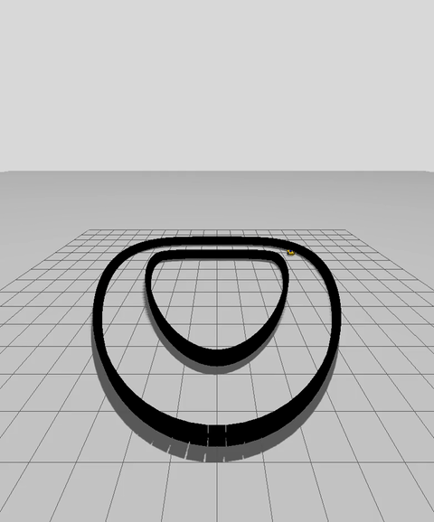
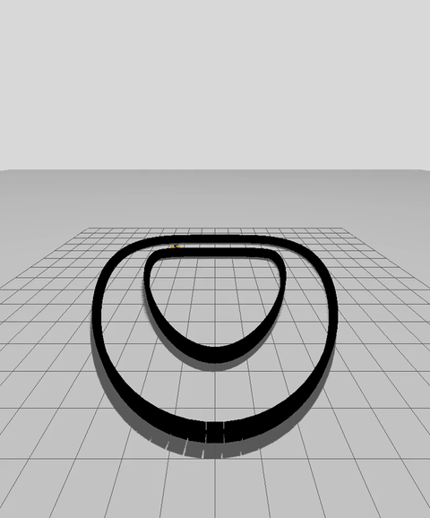
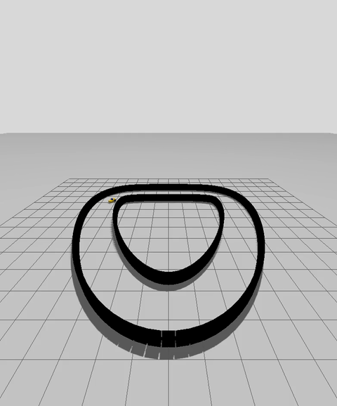
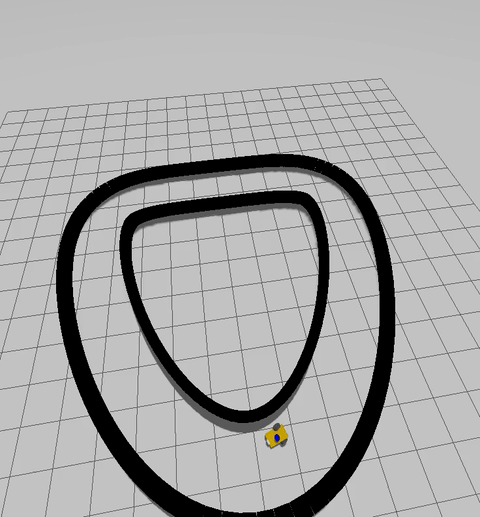
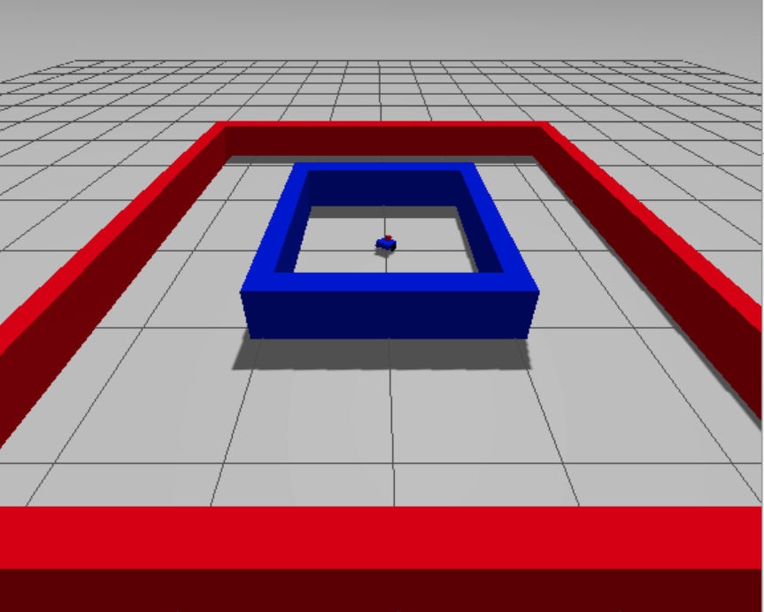

# Agentic Optimization: Autonomous Racing

## Executive Summary
This project demonstrates the power of Agentic Optimization in robotics engineering. Starting with an unusable hardware configuration and zero test environments, we utilized autonomous AI agents to orchestrate the infrastructure, procedurally generate continuous-curve test tracks, and build a CI/CD telemetry referee. We then iteratively designed and tested 5 entirely different control architectures in a single session, evolving from a highly-oscillating reactive wall-follower to an ultra-grip, high-speed equidistant tracker capable of flawlessly navigating complex curves at 3.0 m/s.

### The Evolution of the Algorithm (Algo 1 to 5)

  
  
  
  
  

---

## False Starts & Deadends
A crucial part of our Agentic Optimization workflow was recognizing when a path was technically bankrupt and instantly pivoting. Early orchestrations revealed two major deadends:

### 1. Robot Selection and Weight

  

Original plan was to build the Jetson robot from web sources, this proved frustrating.  With the robot constantly spinning, and not moving.  We instantly pivoted to a simple Differential Drive Robot (orbit_bot) we had experience with in the past.  This was more productive and we tweaked the chassis weight from 1 gram (it originally was not meant to be a racer) to 5KG.  Gif shows the stuttering/flip of the robot due to the previous feather weight. 

### 2. The "Two Boxes" Track Limitation

  

Initially, we attempted to test the algorithms in a primitive environment consisting of only two large boxes with the robot spawned in the middle. We quickly realized this environment was useless for tuning high-speed cornering, as it lacked continuous curves, apexes, or varied track widths.  With the AI spawning the robot right in the middle (!), it was clear that human in the loop was needed.

---

## The Agentic Loop

The core success of this project was driven by a continuous "Agentic Optimization Loop." Rather than manually writing code and guessing why the robot failed, we orchestrated AI agents to build the testing infrastructure, analyze the telemetry, and tune the control logic iteratively. 

The loop consisted of four distinct phases:

### 1. Procedural Environment Generation
To rigorously test high-speed cornering, the basic 5x5 square track was insufficient. We tasked a Gazebo Architect subagent with writing a Python script to procedurally generate a complex, continuous-curve "Kidney Track" in SDF format. This provided a non-trivial environment with varying curve radii and sharp inner waistlines.

### 2. The CI/CD Telemetry Referee
To objectively measure algorithmic improvements, we tasked a second subagent with writing a track-agnostic `referee_node`. Instead of relying on hardcoded checkpoints, this node dynamically calculated X/Y odometry, tracked lap times, monitored average speeds, and output massive arrays of raw telemetry to a `report.json` file after every run.

### 3. Agentic Root-Cause Analysis
As we pushed the speed limits, the robot began failing in bizarre ways that were impossible to diagnose by eye. Instead of manual plotting, we fed the `report.json` telemetry back into the agent for root-cause analysis:
*   **The Tunneling Phenomenon:** Telemetry proved the robot was traveling so fast (`> 3.0 m/s`) that shallow-angle understeer caused it to literally phase through Gazebo's discrete collision meshes into the void.
*   **The Pirouette Bug:** Telemetry revealed that heavy braking at the track's narrow waist dropped the robot's forward speed to `0.5 m/s` while steering was pegged at `2.8 rad/s`. This collapsed the turning radius to `0.17m`, causing the robot to violently spin in place (doing donuts) rather than moving forward. 

### 4. Rapid Algorithm Iteration
Armed with exact telemetry diagnostics, we were able to rapidly iterate through 5 distinct control architectures (Algo 1 to 5) in a single session. For example, we attempted to use a Proportional-Derivative (PD) controller to fix the understeer, but the agentic analysis revealed that the Derivative term actively fights cornering on continuous curves. We instantly nuked the D-term and transitioned to an Ultra-Grip P-Controller, crushing our lap time records.

---

## The Resulting Iterative Improvements

Through the Agentic Loop, we were able to rapidly discard failing theories and evolve the control architecture. The telemetry from each run directly informed the math of the next iteration:

### Algo 1: The Reactive Wall-Follower
*   **Approach:** A basic proportional controller utilizing a 90-degree lateral LiDAR gaze.
*   **The Flaw:** By looking perfectly perpendicular to the robot's heading, the algorithm had zero anticipation. It constantly overshot the center line, resulting in violent, snake-like oscillations down the straights and crashes on sharp turns.

### Algo 2: The Deep-Gaze Gap Follower
*   **Approach:** Shifted the LiDAR gaze to look far ahead (a 20-degree forward cone) to anticipate curves earlier.
*   **The Flaw:** Because the gaze was too narrow, the robot suffered from a "Positive Feedback Loop." Steering away from a wall made the laser ray more parallel to the track, artificially extending the distance reading to infinity and causing the robot to lock its steering and drive in tight circles (donuts).

### Algo 3: The Predictive Equidistant Tracker
*   **Approach:** Discovered the "Negative Feedback Zone." Shifted the gaze to exactly 45 degrees off-center.
*   **The Flaw:** This provided immense stability, and the robot appeared to be completing laps. However, agentic analysis of the telemetry revealed a false positive: the robot was actually taking corners too fast (`> 3.0 m/s`), understeering, and phasing entirely through the Gazebo collision meshes. It was only triggering the lap counter because it was wandering aimlessly in the void and crossing the `X=0` axis.

### Algo 4: The High-Grip Equidistant
*   **Approach:** Hard-capped the maximum speed at `3.0 m/s` to prevent physics tunneling and added a massive braking penalty proportional to the steering angle.
*   **The Flaw:** The heavy braking caused the speed to drop to `0.5 m/s` during sharp cornering. Combined with a high steering angle (`2.8 rad/s`), the turning radius collapsed to `0.17m`, trapping the robot in an infinite "Pirouette Loop." We patched this by introducing an Anti-Pirouette minimum speed floor (`1.5 m/s`) to guarantee forward momentum.

### Algo 5: The Ultra-Grip Optimizer
*   **Approach:** Attempted to implement a Proportional-Derivative (PD) controller to safely raise the speed cap to `4.0 m/s`.
*   **The Flaw & Final Fix:** The telemetry revealed that the Derivative term actively fights cornering on continuous tracks. We stripped out the D-term, cranked the Proportional gain (`Kp`) to `2.5`, and unlocked the differential drive steering limits to `4.0 rad/s`. 
*   **Result:** A massive success. By stripping the D-term and unlocking the steering, the robot carved flawless, ultra-grip racing lines that maximized speed while tightly hugging the inner apexes of complex curves.
*   **Lap Time:** **14.75s average** (Based on the first 3 recorded telemetry laps: 14.27s, 13.00s, 16.99s)

---

## Conclusion & Learnings

The successful evolution of this racing algorithm was not due to a single stroke of genius, but rather the strict adherence to an **Agentic Optimization** workflow. Relying on LLMs simply to "write code" is a deadend; using them to architect CI/CD infrastructure, generate procedural environments, and perform root-cause analysis on massive telemetry payloads is the future of robotics engineering.

Key takeaways from this exercise include:
1.  **Telemetry Over Intuition:** Phenomenons like high-speed physics tunneling and the "Pirouette Loop" were invisible to the naked eye. The Agentic Loop allowed us to instantly crunch thousands of lines of JSON telemetry to pinpoint the mathematical failures.
2.  **Rapid Empirical Iteration:** By automating the testing and refereeing, we were able to iterate through 5 entirely different control architectures in a single session—rapidly discarding failed hypotheses like the PD-controller and gap-following.
3.  **Ruthless Pragmatism:** When early agentic orchestration revealed that the Jetson chassis was physically flawed in Gazebo, and that a basic two-box track was insufficient for testing, we immediately pivoted the hardware and procedurally generated new environments. Agentic workflows empower engineers to pivot dynamically rather than fighting broken dependencies.

---

## Tech Stack

*   **Middleware:** ROS 2 (Jazzy)
*   **Simulation Physics:** Gazebo Harmonic (`ros_gz_sim`)
*   **Languages:** Python (Controllers & Procedural Generation), XML/SDF (Environment Modeling)
*   **Environment:** Docker (`ros2_jazzy_desktop` containerized workspace)
*   **Orchestration:** Google Antigravity (Agentic CI/CD workflow, Autonomous Subagents)
*   **Development IDE:** Emacs (TRAMP & Pyright for Split-Brain Host/Docker development)
